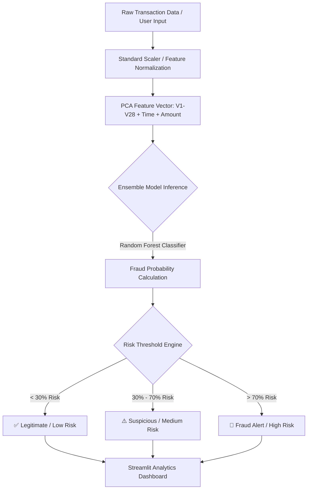

# 🏦 SecureBank AI — Banking Fraud Detection Intelligence System

[](https://www.python.org/)
[](https://streamlit.io/)
[](https://scikit-learn.org/)
[](LICENSE)

An enterprise-grade, machine learning-powered **Banking Fraud Intelligence & Risk Analysis System**. **SecureBank AI** detects fraudulent credit card transactions in real-time using advanced ensemble machine learning techniques, interactive analytics dashboards, and risk probability assessment.

---
## project link : https://bank-fraud-detection-ai.streamlit.app/
## 📌 Executive Summary

Financial fraud costs institutions billions of dollars annually. Detecting fraudulent transactions in modern banking systems is challenging due to extreme class imbalance (less than 0.2% of transactions are fraudulent) and evolving fraud patterns.

**SecureBank AI** addresses this challenge by combining robust data preprocessing, principal component feature scaling, and trained ensemble classifiers (`Random Forest`, `Logistic Regression`, `Decision Tree`, `KNN`) behind a modern, dark-themed Streamlit web interface.

---

## ✨ Key Features

- 📊 **Executive Fraud Intelligence Dashboard**:
  - Real-time transaction monitoring metrics: Total Transactions, Fraud Cases, Legitimate Cases, and Fraud Rate (%).
  - Interactive data distribution visualizations and amount summary statistics.
- 🔍 **Real-Time Transaction Risk Analyzer**:
  - **Single Transaction Assessment**: Manual entry of transaction features (Time, Amount, V1–V28 PCA features).
  - **Batch CSV Processing**: Upload bulk transaction files for automated multi-record fraud scoring.
  - **Probability & Risk Badging**: Instant classification into **Low Risk** ✅, **Medium Risk** ⚠️, or **High Risk / Fraud** 🚨 with confidence score percentages.
- 🤖 **Model Benchmarking & Analytics**:
  - Multi-algorithm model evaluation comparing Accuracy, Precision, Recall, F1 Score, ROC-AUC, and Training Execution Time.
  - Pre-fitted model artifacts (`random_forest.pkl`, `scaler.pkl`) tuned for high recall and ROC-AUC.
- 🐳 **Developer & Container Ready**:
  - Full support for VS Code `.devcontainer` environment for seamless, zero-config reproduction.

---

## 🏗️ System Architecture



---

## 📊 Machine Learning Model Benchmarks

Multiple classification models were trained and evaluated on highly imbalanced credit card transaction datasets. The evaluation metrics demonstrate the superior performance of **Random Forest**:

| Model Algorithm | Accuracy | Precision | Recall | F1 Score | ROC-AUC | Training Time (s) |
| :--- | :---: | :---: | :---: | :---: | :---: | :---: |
| 🌲 **Random Forest** *(Default)* | **99.90%** | **0.6727** | **0.7789** | **0.7220** | **0.9811** | 48.17s |
| ⚡ **KNN Classifier** | 99.80% | 0.4425 | 0.8105 | 0.5725 | 0.9100 | 0.08s |
| 🌳 **Decision Tree** | 98.56% | 0.0829 | 0.7579 | 0.1495 | 0.8163 | 44.73s |
| 📈 **Logistic Regression** | 97.37% | 0.0530 | 0.8737 | 0.1000 | 0.9626 | 1.98s |

> 💡 **Why Random Forest?**  
> While Logistic Regression achieves high recall, Random Forest dramatically reduces false positives—achieving an F1-Score of **0.7220** and an ROC-AUC of **0.9811**, making it the ideal production model for minimizing operational review costs.

---

## 📁 Repository Structure

```dir
Banking Fraud Detection Model/
├── .devcontainer/             # VS Code Remote Development configuration
│   └── devcontainer.json
├── data/
│   └── processed/
│       └── test_processed.csv # Processed evaluation test dataset (33.8 MB)
├── models/
│   ├── logistic_regression.pkl# Saved Logistic Regression artifact
│   ├── random_forest.pkl      # Primary Random Forest classifier
│   └── scaler.pkl             # Trained Feature Scaler (Robust/Standard)
├── Notebook/
│   ├── Data_Preprocessing.ipynb # Notebook: Cleaning, scaling & train-test split
│   ├── EDA.ipynb               # Notebook: Exploratory data analysis & correlations
│   └── ML_ALGO.ipynb           # Notebook: Model training & hyperparameter tuning
├── outputs/
│   └── metrics/
│       └── ml_model_comparison.csv # Performance metrics dataset
├── app.py                      # Main Streamlit Dashboard Application
├── requirements.txt            # Python dependencies
├── .gitignore                  # Git ignore definitions
└── README.md                   # Project documentation
```

---

## 🚀 Quick Start Guide

### Prerequisites

Ensure you have the following installed on your machine:
- **Python 3.9+** (Python 3.10 / 3.11 recommended)
- **Git**

---

### Step 1: Clone the Repository

```bash
git clone https://github.com/Utsav-Saha/Bank-Fraud-Detection-AI.git
cd Bank-Fraud-Detection-AI
```

---

### Step 2: Create & Activate Virtual Environment

**On Windows (PowerShell):**
```powershell
python -m venv venv
.\venv\Scripts\Activate.ps1
```

**On macOS / Linux:**
```bash
python3 -m venv venv
source venv/bin/activate
```

---

### Step 3: Install Dependencies

```bash
pip install --upgrade pip
pip install -r requirements.txt
```

---

### Step 4: Run the Streamlit Application

```bash
streamlit run app.py
```

The application will launch automatically in your default web browser at `http://localhost:8501`.

---

## 💻 User Interface Overview

### 1. 📊 Executive Dashboard
Overview of total processed transactions, fraud distribution charts, fraud rates, and financial metrics.

### 2. 🔍 Analyze Transaction
- **Single Mode**: Enter anonymized transaction numerical features ($V_1$ through $V_{28}$), transaction time, and amount to receive instant fraud risk classification.
- **Batch CSV Upload**: Upload any test dataset CSV (e.g., `data/processed/test_processed.csv`) for bulk risk evaluation and downloadable predictions.

### 3. 🤖 Model Information
Deep dive into model performance metrics, training execution trade-offs, confusion matrices, and ROC-AUC comparisons.

---

## 🛠️ Technology Stack

| Domain | Technology |
| :--- | :--- |
| **Language** | Python 3.9+ |
| **Web Framework** | Streamlit |
| **Machine Learning** | Scikit-Learn, Joblib |
| **Data Processing** | Pandas, NumPy |
| **Data Visualization** | Matplotlib, Seaborn |
| **Development** | Jupyter Notebooks, DevContainers |

---

## 🤝 Contributing

Contributions, issues, and feature requests are welcome!  
Feel free to check the [issues page](https://github.com/Utsav-Saha/Bank-Fraud-Detection-AI/issues) if you want to contribute.

1. Fork the Project
2. Create your Feature Branch (`git checkout -b feature/AmazingFeature`)
3. Commit your Changes (`git commit -m 'Add some AmazingFeature'`)
4. Push to the Branch (`git checkout -b feature/AmazingFeature`)
5. Open a Pull Request

---

## 📜 License

Distributed under the MIT License. See `LICENSE` for more information.

---

<div align="center">
  <sub>Built with ❤️ by Utsav Saha</sub>
</div>
